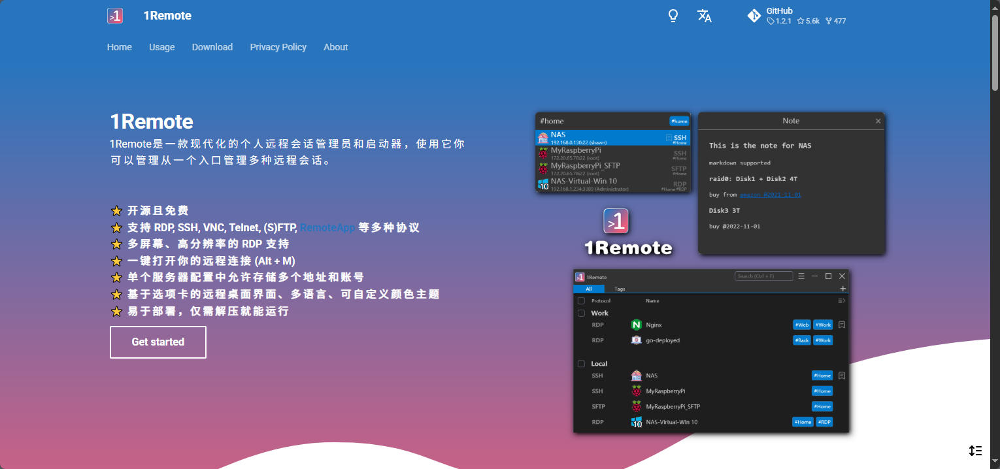

+++
author = "hqqich"
title = "远程会话管理工具，1Remote"
date = "2025-10-22"
description = "RDP SSH VNC Telnet 远程连接工具"
tags = [
    "远程", "windows"
]
+++

## 地址

[github.com/1Remote/1Remote](https://github.com/1Remote/1Remote)

## 功能

- 开源且免费
- 支持 RDP, SSH, VNC, Telnet, (S)FTP, RemoteApp 等多种协议
- 多屏幕、高分辨率的 RDP 支持
- 一键打开你的远程连接 (Alt + M)
- 单个服务器配置中允许存储多个地址和账号
- 基于选项卡的远程桌面界面、多语言、可自定义颜色主题
- 易于部署，仅需解压就能运行
