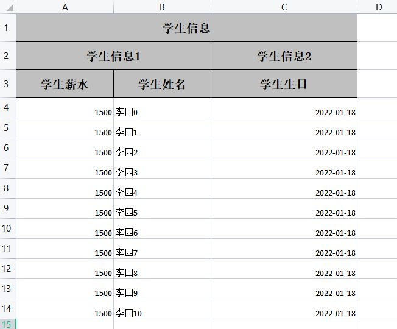
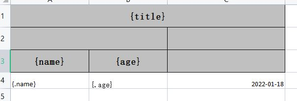
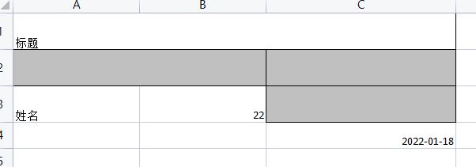

# Java 处理 excel 表格

## easyExcel 组件

> [官方文档](https://www.yuque.com/easyexcel/doc)
>
> [官方文档](https://alibaba-easyexcel.github.io/index.html)
>
> [源码地址](https://github.com/alibaba/easyexcel)
>
> 参考文章：
> 1. [框架篇-easyexcel使用](https://www.jianshu.com/p/d1d264c817ef)
> 2. [](https://www.jianshu.com/p/d1d264c817ef)
> 3. [JAVA使用easyexcel操作Excel](https://blog.csdn.net/jianggujin/article/details/80200400)
> 4. [EasyExcel 动态表头生成且带合并](https://blog.csdn.net/xuxiannian/article/details/105029283)
> 4. [easyExcel 使用指南详解](https://zhuanlan.zhihu.com/p/98042288)
> 4. [EasyExcel模板填充踩坑](https://www.cnblogs.com/funnylog/p/14248982.html)
> 4. []()
> 4. []()
> 4. []()
> 4. []()

#### 1. 引入依赖
```xml
<!-- https://mvnrepository.com/artifact/com.alibaba/easyexcel -->
<dependency>
    <groupId>com.alibaba</groupId>
    <artifactId>easyexcel</artifactId>
    <version>3.0.5</version>
</dependency>
```

#### 2. 简单例子（实体类方式）

创建一个实体类`Student`：
```java
import com.alibaba.excel.annotation.ExcelIgnore;
import com.alibaba.excel.annotation.ExcelProperty;
import com.alibaba.excel.annotation.format.DateTimeFormat;
import com.alibaba.excel.annotation.write.style.ColumnWidth;
import com.alibaba.excel.annotation.write.style.ContentRowHeight;
import com.alibaba.excel.annotation.write.style.HeadRowHeight;
import lombok.Data;
import java.io.Serializable;
import java.util.Date;

@Data
@HeadRowHeight(value = 35) // 表头行高
@ContentRowHeight(value = 25) // 内容行高
public class Student implements Serializable {

  @ExcelProperty(value = {"学生信息","学生信息2","学生编号"},order = 10)  //自定义title 和 order位置等级，值越大越靠后
  @ColumnWidth(20)  //自定义宽度
  @ExcelIgnore  //创建excel时忽略这个属性
  private Integer id;

  @ExcelProperty(value = {"学生信息","学生信息1","学生姓名"},order = 2)
  @ColumnWidth(20)
  private String name;

  @ExcelProperty(value = {"学生信息","学生信息1","学生薪水"},order = 1)
  @ColumnWidth(20)
  private Double salary;

  @ExcelProperty(value = {"学生信息","学生信息2","学生生日"},order = 11)
  @DateTimeFormat("yyyy-MM-dd")  //格式化日期 别导错了，是这个=>com.alibaba.excel.annotation.format.DateTimeFormat;
  @ColumnWidth(30)
  private Date birthday;
}
```

写一个测试类：
```java
public List<Student> getData() {
  return new ArrayList<Student>(){{
    for (int i = 0; i < 10; i++) {
      add(new Student(i, "name"+i, 1000.00+i, new Date()));
    }
  }};
}

@Test
void contextLoads() {
  //第一个参数： 写出表格的文件名; 第二个参数：写到表格数据类型的class对象
  EasyExcel.write("学生信息表.xlsx", Student.class)  //创建一个表格，指定文件名，指定数据类型
      // .registerWriteHandler(new LongestMatchColumnWidthStyleStrategy())  //自适应宽度，但是这个不是特别精确
      .sheet()  //指定sheet , 可以指定名字，也可以不写，使用默认的
      .doWrite(getData());  //将数据写入表格中
}
```
运行后项目根目录就会出现一个文件


excel文件里就长这个样子


还可以指定写
```java
@HeadRowHeight(value = 35) // 表头行高
@ContentRowHeight(value = 25) // 内容行高
@Data
public class Student implements Serializable {

    @ExcelProperty(value = {"学生信息","学生编号"},order = 10)
    private Integer id;

    @ExcelProperty(value = {"学生信息","学生姓名"},order = 2)
    private String name;

    @ExcelProperty(value = {"学生信息","学生薪水"},order = 1)
    private Double salary;

    @ExcelProperty(value = {"学生信息","学生生日"},order = 11)
    @DateTimeFormat("yyyy-MM-dd")
    private Date birthday;
}


@Test
void contextLoads() {
    // 设置 要导出列的属性名
    // 必须要跟类型的属性名保持一致
    Set<String> set = new HashSet<>();
    set.add("id");
    set.add("name");

    EasyExcel.write("学生信息表.xlsx", Student.class)
        .includeColumnFiledNames(set)
        // 自适应宽度，但是这个不是特别精确
        .registerWriteHandler(new LongestMatchColumnWidthStyleStrategy())
        .sheet()
        .doWrite(getData());
}
```

#### 3. 简单读
记住，这里传入的excel 表格式一定和实体类对应，不然会现数据读不全，读错
```java
@Test
  void test011(){
    List<Student> list = new ArrayList<>();
    EasyExcel.read("学生信息表.xlsx", Student.class, new AnalysisEventListener<Student>() {

      // 每读取一行就调用该方法
      @Override
      public void invoke(Student student, AnalysisContext analysisContext) {
        list.add(student);
      }

      // 全部读取完成就调用该方法
      @Override
      public void doAfterAllAnalysed(AnalysisContext analysisContext) {
        System.out.println("全部读取完成");
      }
    }).sheet().doRead();

    list.forEach(System.out::println);
    /**
     * 全部读取完成
     * Student(id=null, name=李四0, salary=1500.0, birthday=Tue Jan 18 09:38:35 CST 2022)
     * Student(id=null, name=李四1, salary=1500.0, birthday=Tue Jan 18 09:38:35 CST 2022)
     * Student(id=null, name=李四2, salary=1500.0, birthday=Tue Jan 18 09:38:35 CST 2022)
     * Student(id=null, name=李四3, salary=1500.0, birthday=Tue Jan 18 09:38:35 CST 2022)
     * Student(id=null, name=李四4, salary=1500.0, birthday=Tue Jan 18 09:38:35 CST 2022)
     * Student(id=null, name=李四5, salary=1500.0, birthday=Tue Jan 18 09:38:35 CST 2022)
     * Student(id=null, name=李四6, salary=1500.0, birthday=Tue Jan 18 09:38:35 CST 2022)
     * Student(id=null, name=李四7, salary=1500.0, birthday=Tue Jan 18 09:38:35 CST 2022)
     * Student(id=null, name=李四8, salary=1500.0, birthday=Tue Jan 18 09:38:35 CST 2022)
     * Student(id=null, name=李四9, salary=1500.0, birthday=Tue Jan 18 09:38:35 CST 2022)
     * Student(id=null, name=李四10, salary=1500.0, birthday=Tue Jan 18 09:38:35 CST 2022)
     */
  }
```


#### excel工具类 `ExcelUtil.java`
```Java
package com.example.demoeasyexclespringboot.util;

import com.alibaba.excel.EasyExcel;
import com.alibaba.excel.context.AnalysisContext;
import com.alibaba.excel.event.AnalysisEventListener;
import com.alibaba.excel.read.listener.ReadListener;
import com.alibaba.excel.support.ExcelTypeEnum;
import com.alibaba.excel.write.builder.ExcelWriterBuilder;
import com.alibaba.excel.write.style.column.LongestMatchColumnWidthStyleStrategy;
import org.apache.commons.lang3.StringUtils;
import org.springframework.util.CollectionUtils;
import org.springframework.web.multipart.MultipartFile;

import javax.servlet.http.HttpServletResponse;
import java.io.*;
import java.util.*;

public class ExcelUtil {

  /**
   * 写出一个 excel 文件到本地
   * <br />
   * 将类型所有加了 @ExcelProperty 注解的属性全部写出
   *
   * @param fileName  文件名 不要后缀
   * @param sheetName sheet名
   * @param data      写出的数据
   * @param clazz     要写出数据类的Class类型对象
   * @param <T>       写出的数据类型
   */
  public static <T> void writeExcel(String fileName, String sheetName, List<T> data, Class<T> clazz) {
    writeExcel(null, fileName, sheetName, data, clazz);
  }


  /**
   * 按照指定的属性名进行写出 一个 excel
   *
   * @param attrName  指定的属性名 必须与数据类型的属性名一致
   * @param fileName  文件名 不要后缀
   * @param sheetName sheet名
   * @param data      要写出的数据
   * @param clazz     要写出数据类的Class类型对象
   * @param <T>       要写出的数据类型
   */
  public static <T> void writeExcel(Set<String> attrName, String fileName, String sheetName, List<T> data, Class<T> clazz) {
    fileName = StringUtils.isBlank(fileName) ? "学生管理系统" : fileName;
    sheetName = StringUtils.isBlank(sheetName) ? "sheet0" : sheetName;

    try(FileOutputStream fos = new FileOutputStream(fileName)) {
      write(fos,attrName,sheetName,data,clazz);
    } catch (Exception exception) {
      exception.printStackTrace();
    }
  }

  /**
   * 读取 指定格式的 excel文档
   *
   * @param fileName 文件名
   * @param clazz    数据类型的class对象
   * @param <T>      数据类型
   * @return
   */
  public static <T> List<T> readExcel(String fileName, Class<T> clazz) {
    return readExcel(fileName, clazz, null);
  }

  /**
   * 取 指定格式的 excel文档
   * 注意一旦传入自定义监听器，则返回的list为空，数据需要在自定义监听器里面获取
   *
   * @param fileName     文件名
   * @param clazz        数据类型的class对象
   * @param readListener 自定义监听器
   * @param <T>          数据类型
   * @return
   */
  public static<T> List<T> readExcel(String fileName, Class<T> clazz, ReadListener<T> readListener) {
    try(FileInputStream fis = new FileInputStream(fileName)) {
      return read(fis,clazz,readListener);
    } catch (Exception exception) {
      exception.printStackTrace();
    }
    return null;
  }


  /**
   * 导出  一个 excel
   *         导出excel所有数据
   * @param response
   * @param fileName  件名 最好为英文，不要后缀名
   * @param sheetName sheet名
   * @param data      要写出的数据
   * @param clazz     要写出数据类的Class类型对象
   * @param <T>       要写出的数据类型
   */
  public static <T> void export(HttpServletResponse response, String fileName, String sheetName, List<T> data, Class<T> clazz) {
    export(response, null, fileName, sheetName, data, clazz);
  }

  /**
   * 按照指定的属性名进行写出 一个 excel
   *
   * @param response
   * @param attrName  指定的属性名 必须与数据类型的属性名一致
   * @param fileName  文件名 最好为英文，不要后缀名
   * @param sheetName sheet名
   * @param data      要写出的数据
   * @param clazz     要写出数据类的Class类型对象
   * @param <T>       要写出的数据类型
   */
  public static <T> void export(HttpServletResponse response, Set<String> attrName, String fileName, String sheetName, List<T> data, Class<T> clazz) {

    fileName = StringUtils.isBlank(fileName) ? "student-system-manager" : fileName;
    sheetName = StringUtils.isBlank(sheetName) ? "sheet0" : sheetName;

    response.setContentType("application/vnd.ms-excel;charset=utf-8");
    response.setCharacterEncoding("utf-8");
    response.addHeader("Content-disposition", "attachment;filename=" + fileName + ExcelTypeEnum.XLSX.getValue());

    try(OutputStream os = response.getOutputStream()) {
      write(os,attrName,sheetName,data,clazz);
    } catch (IOException e) {
      e.printStackTrace();
    }
  }


  /**
   * 接收一个excel文件，并且进行解析
   *  注意一旦传入自定义监听器，则返回的list为空，数据需要在自定义监听器里面获取
   * @param multipartFile excel文件
   * @param clazz 数据类型的class对象
   * @param readListener 监听器
   * @param <T>
   * @return
   */
  public static <T> List<T> importExcel(MultipartFile multipartFile,Class<T> clazz,ReadListener<T> readListener) {
    try(InputStream inputStream = multipartFile.getInputStream()) {
      return read(inputStream,clazz,readListener);
    } catch (IOException e) {
      e.printStackTrace();
    }
    return null;
  }


  private static <T> void write(OutputStream os, Set<String> attrName, String sheetName, List<T> data, Class<T> clazz) {
    ExcelWriterBuilder write = EasyExcel.write(os, clazz);
    // 如果没有指定要写出那些属性数据，则写出全部
    if (!CollectionUtils.isEmpty(attrName)) {
      write.includeColumnFiledNames(attrName);
    }
    write.registerWriteHandler(new LongestMatchColumnWidthStyleStrategy()).sheet(sheetName).doWrite(data);
  }


  private static <T> List<T> read(InputStream in,Class<T> clazz, ReadListener<T> readListener) {
    List<T> list = new ArrayList<>();
    Optional<ReadListener> optional = Optional.ofNullable(readListener);
    EasyExcel.read(in, clazz, optional.orElse(new AnalysisEventListener<T>() {
      @Override
      public void invoke(T data, AnalysisContext context) {
        list.add(data);
      }
      @Override
      public void doAfterAllAnalysed(AnalysisContext context) {
        System.out.println("解析完成");
      }
    })).sheet().doRead();
    return list;
  }
}

```

#### 使用模板
##### 1. map类型传参

##### 2.实体类型传参

##### 例子1
模板样子


> 注意，这里需要循环的数据需要用.表示：`{.name}` 表示是对象中的属性

```java
@Test
void test05(){
  //准备模板
  String template = "a.xlsx";
  ExcelWriterBuilder builder = EasyExcel.write("hqqich.xlsx", Map.class).withTemplate(template);

  //准备map数据
  Map<String, Object> map=new HashMap<>();
  map.put("title", "标题");
  map.put("name","姓名");
  map.put("age",22);

  //简单写
  builder.sheet().doFill(map);
}
```
写入后样子



可以看到样式被清楚了，弊端

##### 例子2

```java
//FileData
@Data
@NoArgsConstructor
@AllArgsConstructor
public class FileData {

  private String age;

  private String name;

}

//测试方法
@Test
void test06(){
  ExcelWriterBuilder builder = EasyExcel.write("hqqich.xlsx", FileData.class).withTemplate("a.xlsx");
  List<FileData> fileDataList = new ArrayList<FileData>(){{
    add(new FileData("100", "hqqich"));
    add(new FileData("200", "hqqich"));
    add(new FileData("300", "hqqich"));
    add(new FileData("400", "hqqich"));
    add(new FileData("400", "hqqich"));
    add(new FileData("400", "hqqich"));
    add(new FileData("400", "hqqich"));
    add(new FileData("400", "hqqich"));
    add(new FileData("400", "hqqich"));
    add(new FileData("400", "hqqich"));
    add(new FileData("400", "hqqich"));
    add(new FileData("400", "hqqich"));
    add(new FileData("400", "hqqich"));
    add(new FileData("400", "hqqich"));
    add(new FileData("400", "hqqich"));
    add(new FileData("400", "hqqich"));
    add(new FileData("400", "hqqich"));
    add(new FileData("400", "hqqich"));
    add(new FileData("400", "hqqich"));
    add(new FileData("400", "hqqich"));
  }};
  builder.sheet().doFill(fileDataList);
}
```
写入后的样子


可以看到，循环的的单元格样式被保留下来了


##### 例子3
```java
@Test
@SneakyThrows
void test08(){

  //创建.关联文件
  ExcelWriter build = EasyExcel.write("hqqich.xlsx").withTemplate("a.xlsx").build();

  //工作区对象
  WriteSheet sheet = EasyExcel.writerSheet().build();

  //渲染数据
  List<FileData> fileDataList = new ArrayList<FileData>(){{
    add(new FileData("100", "hqqich"));
    add(new FileData("200", "hqqich"));
    add(new FileData("300", "hqqich"));
    add(new FileData("400", "hqqich"));
    add(new FileData("400", "hqqich"));
    add(new FileData("400", "hqqich"));
    add(new FileData("400", "hqqich"));
    add(new FileData("400", "hqqich"));
    add(new FileData("400", "hqqich"));
    add(new FileData("400", "hqqich"));
    add(new FileData("400", "hqqich"));
    add(new FileData("400", "hqqich"));
    add(new FileData("400", "hqqich"));
    add(new FileData("400", "hqqich"));
    add(new FileData("400", "hqqich"));
    add(new FileData("400", "hqqich"));
    add(new FileData("400", "hqqich"));
    add(new FileData("400", "hqqich"));
    add(new FileData("400", "hqqich"));
    add(new FileData("400", "hqqich"));
  }};
  HashMap<String, Object> hashMap = new HashMap<String, Object>(){{
    put("title", "标题");
    put("name", "用户姓名");
    put("age", "用户年龄");
  }};

  //添加数据
  build.fill(fileDataList, sheet);
  build.fill(hashMap, sheet);

  //保存
  build.finish();
}
```
写入后的样子


可以看到（标题栏，循环的数据）中的样式都被保留下来了


##### 例子3的另一种写法
```java
@Test
@SneakyThrows
void test09(){

  //创建.关联文件
  ExcelWriter build = EasyExcel.write("hqqich.xlsx").withTemplate("a.xlsx").build();

  //工作区对象
  WriteSheet sheet = EasyExcel.writerSheet().build();

  //渲染数据
  List<Map<String, Object>> fileDataList = new ArrayList<Map<String, Object>>(){{
    for (int i = 0; i < 10; i++) {
      int finalI = i;
      add(new HashMap<String, Object>() {{
        put("name", "hqqich"+ finalI);
        put("age", 22+ finalI);
      }});
    }
  }};
  HashMap<String, Object> hashMap = new HashMap<String, Object>(){{
    put("title", "标题");
    put("name", "用户姓名");
    put("age", "用户年龄");
  }};

  //添加数据
  build.fill(fileDataList, sheet);
  build.fill(hashMap, sheet);

  //保存
  build.finish();
}
```


##### 例子4

```java
@Test
void test061(){
  ExcelWriterBuilder builder = EasyExcel.write("hqqich.xlsx", Map.class).withTemplate("a.xlsx");
  List<Map<String, Object>> fileDataList = new ArrayList<Map<String, Object>>(){{
    for (int i = 0; i < 10; i++) {
      int finalI = i;
      add(new HashMap<String, Object>() {{
        put("name", "hqqich"+ finalI);
        put("age", 22+ finalI);
      }});
    }
  }};
  builder.sheet().doFill(fileDataList);
}
```
写入后的样子


